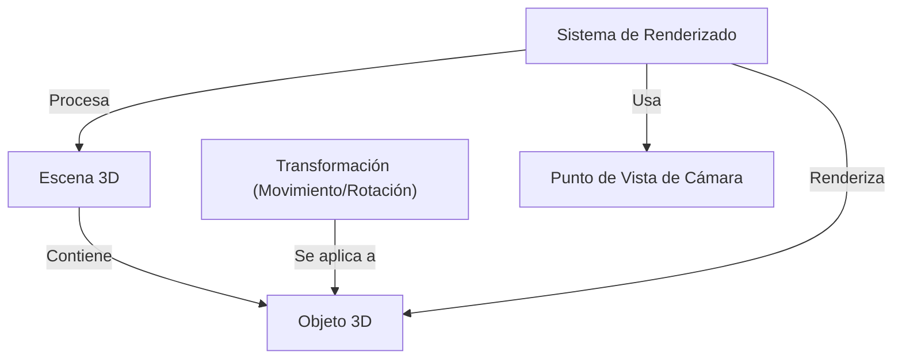
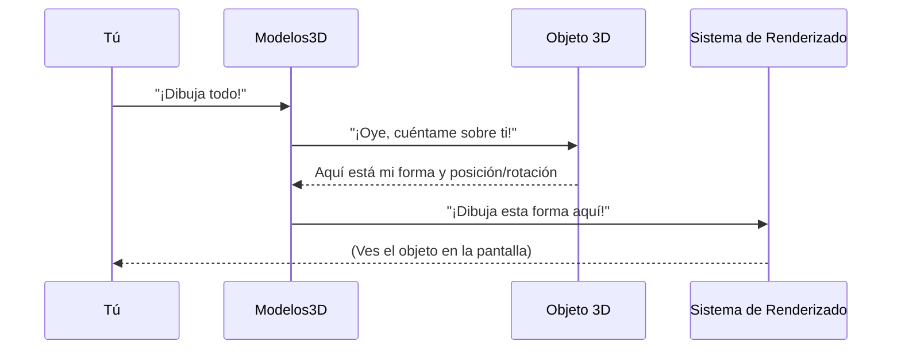
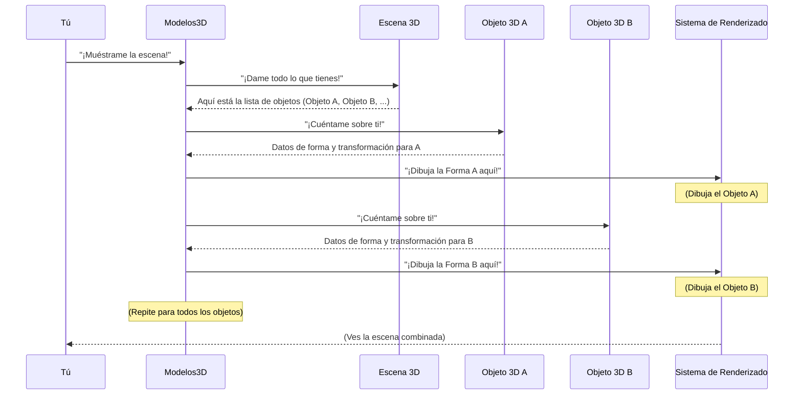
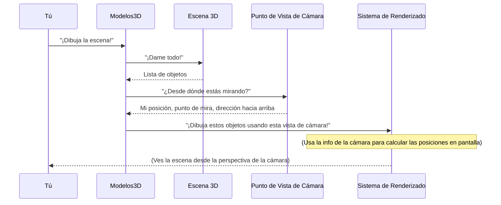
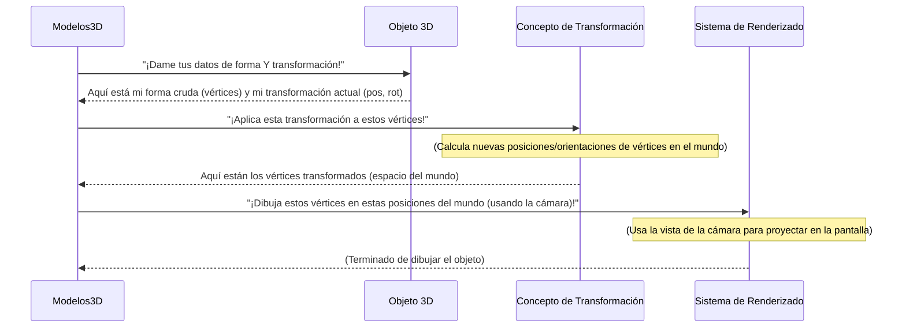
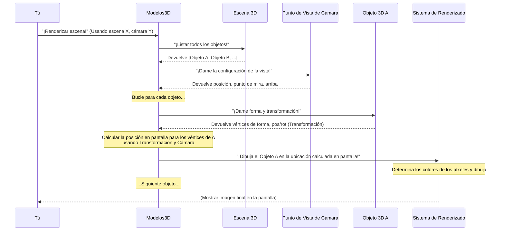

simula una **escena 3D** donde existen los objetos, utiliza un **punto de vista de cámara**
para determinar qué es visible y emplea un **sistema de renderizado**
para dibujar la imagen final. Los objetos dentro de la escena también se pueden cambiar
(como rotar) a través de **transformaciones**.

## Resumen Visual



## Capítulos

1.  [Objeto 3D](01_3d_object_.md)
2.  [Escena 3D](02_3d_scene_.md)
3.  [Punto de Vista de Cámara](03_camera_viewpoint_.md)
4.  [Transformación (Movimiento/Rotación)](04_transformation__movement_rotation__.md)
5.  [Sistema de Renderizado](05_rendering_system_.md)

# Capítulo 1: Objeto 3D

¡Bienvenido al tutorial de `Modelos3D`! En este primer capítulo, vamos a comenzar con los componentes básicos para crear visuales en 3D: el **Objeto 3D**.

Piensa en el ejemplo mencionado en el `README.md`: la "Esfera Giratoria". ¿Qué es esa esfera? Es algo visible que existe en nuestro mundo 3D. Tiene una forma (una esfera) y está en un lugar específico, quizás girando. Este "algo visible" es exactamente a lo que nos referimos con un **Objeto 3D**.

Imagina montar una obra en un escenario. Un **Objeto 3D** es como uno de los accesorios físicos en ese escenario: una silla, una mesa, un árbol o, en nuestro caso, una esfera. Cada accesorio tiene su propia apariencia (su forma) y está colocado en un lugar específico, mirando en una dirección determinada.

En `Modelos3D`, el concepto de `Objeto 3D` nos ayuda a representar estos "accesorios" individuales. Responde a dos preguntas principales sobre cualquier cosa que queramos ver en nuestro mundo 3D:

1.  **¿Cómo se ve?** (Su forma)
2.  **¿Dónde está y cómo está orientado?** (Su posición y rotación)

Desglosemos esto un poco más.

## ¿De qué está hecho un Objeto 3D?

Un **Objeto 3D** en `Modelos3D` contiene la información necesaria para dibujarlo. Las dos piezas clave de información son:

1.  **Datos de Forma:** Esto describe la forma real del objeto. Para objetos simples como nuestra esfera, esto podría significar definir matemáticamente una esfera. Para objetos más complejos como una casa o un coche, la forma generalmente se describe como una colección de puntos (llamados **vértices**) conectados por superficies planas (llamadas **caras** o triángulos).

2.  **Transformación:** Esto nos dice dónde se encuentra el objeto en el mundo 3D (su posición) y cómo está rotado. ¿Está la esfera en el centro? ¿Se ha movido hacia un lado? ¿Está girando? Todo esto es manejado por su transformación. Profundizaremos mucho más en esto en [Transformación (Movimiento/Rotación)](04_transformation__movement_rotation__.md), pero por ahora, solo debes saber que el objeto mantiene un registro de esto.

## Nuestro Ejemplo: La Esfera Giratoria

La "Esfera Giratoria" del `README.md` es un ejemplo perfecto de un **Objeto 3D**. Es un objeto con la forma de una esfera y tiene una transformación que incluye una posición y una rotación continua, lo que la hace girar.

## Cómo Funciona por Dentro (Conceptualmente)

Cuando `Modelos3D` necesita mostrar algo, mira los **Objetos 3D** que has creado. Para cada objeto, necesita averiguar:

1.  **Su Forma:** Obtener los datos de la forma (como los vértices y las caras).
2.  **Su Lugar:** Aplicar su transformación (posición y rotación) para saber exactamente dónde están esos vértices en el mundo 3D en este momento.
3.  **Cómo Dibujarlo:** Pasar esta información al sistema que realmente dibuja cosas en tu pantalla (el [Sistema de Renderizado](05_rendering_system_.md)).

Aquí hay una visión muy simple de este proceso:



Este diagrama muestra cómo *tú* pides a `Modelos3D` que dibuje, `Modelos3D` habla con el **Objeto 3D** para obtener sus detalles y luego le dice al [Sistema de Renderizado](05_rendering_system_.md) qué dibujar y dónde.

## Una Idea de Código muy Simple (Conceptual)

Aunque el código exacto para crear objetos depende del diseño de la biblioteca `Modelos3D`, la idea suele ser sencilla. Podrías tener algo que represente la forma y algo que contenga su posición y rotación.

Imaginemos una versión muy simplificada donde creas un objeto de esfera:

```python
# Esto es solo una idea simplificada, no el código real de la biblioteca
class SimpleSphereObject:
    def __init__(self):
        # Representa los datos de la forma (p. ej., vértices/caras para una esfera)
        self.shape = "sphere" 
        # Representa la posición y rotación del objeto
        self.transformation = {"position": (0, 0, 0), "rotation": (0, 0, 0)} 

    def update_rotation(self, angle_x, angle_y, angle_z):
        # Una forma simple de cambiar su rotación (más complejo en la realidad)
        self.transformation["rotation"] = (angle_x, angle_y, angle_z)
        print(f"Rotación de la esfera actualizada a {self.transformation['rotation']}")

# Imagina que creas uno así
my_sphere = SimpleSphereObject()
print(f"Creado un objeto esfera con forma: {my_sphere.shape}")
my_sphere.update_rotation(0, 10, 0) # Hacer que gire un poco alrededor del eje Y
```

En este ejemplo, `SimpleSphereObject` es nuestro **Objeto 3D** básico. Contiene su `shape` (forma) y su `transformation` (transformación). Incluso podemos actualizar su `rotation` (rotación) usando un método como `update_rotation`. Esto muestra cómo un objeto mantiene un registro de su propio estado.

*Nota:* El código real en `Modelos3D` será más sofisticado para manejar gráficos 3D reales, pero la idea fundamental de que un objeto contenga su forma y transformación es la misma.

## Conclusión

En este capítulo, aprendimos que un **Objeto 3D** es la unidad básica que representa un elemento visible en nuestro mundo 3D, como la Esfera Giratoria. Contiene información sobre su forma y su posición/orientación (transformación). Piensa en él como un accesorio en un escenario, con su propia apariencia y lugar.

Entender los **Objetos 3D** es el primer paso para construir cualquier escena 3D. Pero, ¿dónde existen estos objetos? ¡Viven *dentro* de algo más grande!

¿Listo para ver cómo se unen múltiples objetos? Pasemos al siguiente capítulo: [Escena 3D](02_3d_scene_.md).

---
# Capítulo 2: Escena 3D

¡Bienvenido de nuevo al tutorial de `Modelos3D`! En el [capítulo anterior](01_3d_object_.md), aprendimos sobre el **Objeto 3D**, el bloque de construcción fundamental, como un solo accesorio en un escenario. Vimos cómo un objeto tiene su propia forma y sabe dónde está y cómo está orientado en el mundo 3D.

¡Pero un solo accesorio no hace una obra! ¿Qué pasa si tienes múltiples objetos? ¿Una esfera y un cubo? ¿Dónde van todos? Necesitan un lugar para existir juntos.

Aquí es donde entra en juego la **Escena 3D**.

## ¿Qué es una Escena 3D?

Imagina el escenario mismo de nuestra analogía de la obra. Es toda el área donde ocurre la representación. Contiene todos los accesorios ([Objetos 3D](01_3d_object_.md)). Podría tener un telón de fondo, iluminación específica u otras configuraciones ambientales.

En `Modelos3D`, la **Escena 3D** es ese escenario virtual. Es el contenedor o mundo donde todos tus [Objetos 3D](01_3d_object_.md) viven simultáneamente.

El propósito principal de una **Escena 3D** es gestionar todo lo que necesita ser mostrado en tu mundo 3D. Contiene:

1.  **Una Colección de Objetos 3D:** Este es su trabajo principal: mantener un registro de todos los objetos individuales que has creado.
2.  **Configuraciones del Entorno:** Cosas como el color del fondo o quizás configuraciones relacionadas con la iluminación (aunque la iluminación avanzada podría cubrirse en otro lugar).
3.  **Potencialmente la Cámara:** A menudo, la escena también es donde defines *cómo* estás mirando el mundo, utilizando un [Punto de Vista de Cámara](03_camera_viewpoint_.md). ¡Cubriremos esta parte crucial en el próximo capítulo!

## El Caso de Uso: Mostrar Múltiples Objetos

Digamos que quieres mostrar no solo la esfera giratoria, sino también un cubo estático a su lado. Necesitas una **Escena 3D** para contener tanto el objeto esfera como el objeto cubo.

Este es el proceso básico:

1.  **Crear la Escena:** Primero, preparas tu escenario virtual.
2.  **Crear Objetos:** Creas tus accesorios individuales (el objeto esfera, el objeto cubo).
3.  **Añadir Objetos a la Escena:** Colocas los accesorios en tu escenario (añades el objeto esfera y el objeto cubo a la escena).
4.  **Ver la Escena:** Miras el escenario (esto involucra el [Punto de Vista de Cámara](03_camera_viewpoint_.md) y el [Sistema de Renderizado](05_rendering_system_.md)).

## Cómo Usar una Escena 3D (Código Conceptual)

Nuevamente, el código exacto depende del diseño de `Modelos3D`, pero veamos una idea simple. Típicamente, crearías un objeto Escena y luego usarías métodos para añadirle otros objetos.

Imagina que ya has creado un `SphereObject` y un `CubeObject` (como el conceptual del Capítulo 1).

```python
# Esta es una idea simplificada
# Asumimos que SphereObject y CubeObject existen del concepto del Capítulo 1

class SimpleScene:
    def __init__(self):
        # La escena contiene una lista de todos los objetos que hay en ella
        self.objects = []
        self.background_color = (0.1, 0.1, 0.2) # Fondo azul oscuro

    def add_object(self, obj):
        # Método para agregar un objeto a la escena
        self.objects.append(obj)
        print(f"Añadido un objeto a la escena. Objetos totales: {len(self.objects)}")

# --- Resolviendo el Caso de Uso ---

# 1. Crear la Escena
my_scene = SimpleScene()
print("Creada una nueva escena.")

# 2. Crear Objetos (usando nuestros objetos conceptuales del Capítulo 1)
my_sphere = SimpleSphereObject() # Asumimos que esto existe
my_cube = SimpleCubeObject()     # Asumimos que esto existe

# Establecer una posición para el cubo para que no esté encima de la esfera (la esfera está en 0,0,0)
my_cube.transformation["position"] = (2, 0, 0) 
print("Creados los objetos esfera y cubo.")

# 3. Añadir Objetos a la Escena
my_scene.add_object(my_sphere)
my_scene.add_object(my_cube)

# Ahora 'my_scene' contiene tanto la esfera como el cubo.
```

En este código conceptual:
* Definimos una clase `SimpleScene` que tiene una lista para contener `objects`.
* El método `add_object` nos permite poner objetos en la lista de la escena.
* Creamos los objetos `my_sphere` y `my_cube` (usando las ideas del capítulo anterior).
* *Añadimos* tanto `my_sphere` como `my_cube` a `my_scene`.

Ahora, `my_scene` conoce ambos objetos y sus posiciones y rotaciones individuales.

## Cómo Funciona por Dentro (Conceptualmente)

Cuando `Modelos3D` necesita dibujar la imagen completa (renderizar la escena), necesita saber *todo* lo que hay en la escena. Le pide a la **Escena 3D** su contenido.

La **Escena 3D** luego proporciona su lista de [Objetos 3D](01_3d_object_.md). El [Sistema de Renderizado](05_rendering_system_.md) (que cubriremos más adelante) luego recorre cada objeto de esa lista y determina cómo dibujarlo en su posición y rotación específicas.

Aquí hay una visión simple de este proceso:



Este diagrama muestra a `Modelos3D` pidiendo a la **Escena 3D** su lista de objetos. Luego, `Modelos3D` trabaja con cada **Objeto 3D** individualmente para obtener sus detalles y le dice al [Sistema de Renderizado](05_rendering_system_.md) cómo dibujar cada uno. La imagen final que ves es la combinación de todos los objetos dibujados en el mismo escenario virtual.

## Conclusión

La **Escena 3D** es como el contenedor o mundo donde todos tus [Objetos 3D](01_3d_object_.md) viven juntos. Gestiona la colección de objetos y proporciona contexto como la configuración del fondo. Es esencial para traer múltiples objetos a la misma vista.

Ahora que tenemos un mundo con objetos en él, ¿cómo lo *miramos* realmente? ¡Necesitamos un punto de vista!

Pasemos al siguiente capítulo para aprender sobre el [Punto de Vista de Cámara](03_camera_viewpoint_.md).

---
# Capítulo 3: Punto de Vista de Cámara

¡Bienvenido de nuevo! En el [capítulo anterior](02_3d_scene_.md), aprendimos sobre la **Escena 3D**, el escenario virtual donde todos nuestros [Objetos 3D](01_3d_object_.md) viven juntos. Podemos crear una escena y añadirle esferas, cubos y otros elementos.

Pero si tenemos una maravillosa escena llena de objetos, ¿cómo la *vemos* realmente? ¡Necesitamos decidir dónde estamos parados y hacia dónde estamos mirando!

Este es exactamente el trabajo del **Punto de Vista de Cámara**.

## ¿Qué es un Punto de Vista de Cámara?

Piensa de nuevo en nuestra analogía del escenario. Tienes tu escenario ([Escena 3D](02_3d_scene_.md)) con accesorios ([Objetos 3D](01_3d_object_.md)) sobre él. Ahora, imagina que vas a filmar esta obra. Necesitas instalar una cámara.

El **Punto de Vista de Cámara** en `Modelos3D` es justo como esa cámara. Determina:

1.  **¿Dónde estás parado?** (La posición de la cámara)
2.  **¿En qué dirección estás mirando?** (La dirección de la mirada de la cámara)
3.  **¿Qué dirección es 'arriba'?** (Esto ayuda a asegurar que la cámara no esté inclinada lateralmente)

Sin un **Punto de Vista de Cámara**, `Modelos3D` no sabría qué parte de la escena mostrarte en tu pantalla. ¡Es como tener un escenario en una habitación oscura, necesitas una forma de verlo!

El ejemplo de la "Esfera Giratoria" del `README.md` utiliza un **Punto de Vista de Cámara** para mostrarte la esfera desde un ángulo específico, generalmente un poco descentrado y mirando hacia el centro.

## El Caso de Uso: Mirar la Escena

El principal caso de uso del **Punto de Vista de Cámara** es simplemente: **¡ver tu escena 3D!**

Si has puesto una esfera y un cubo en tu [Escena 3D](02_3d_scene_.md), la cámara es cómo decides si los ves uno al lado del otro, uno detrás del otro, desde arriba o desde cualquier otra perspectiva.

Este es el proceso básico:

1.  **Crear la Escena:** Prepara tu mundo virtual (como en el Capítulo 2).
2.  **Añadir Objetos:** Coloca tus [Objetos 3D](01_3d_object_.md) en la escena.
3.  **Configurar la Cámara:** Define dónde está tu cámara y a qué está mirando.
4.  **Renderizar:** Dile a `Modelos3D` que dibuje la escena *desde la perspectiva de la cámara* (usando el [Sistema de Renderizado](05_rendering_system_.md)).

## Cómo Usar un Punto de Vista de Cámara (Código Conceptual)

En `Modelos3D`, típicamente tendrás una forma de definir una cámara o configurar los ajustes de vista, a menudo relacionados con la escena o la ventana donde se muestra la escena.

Imaginemos una forma sencilla de establecer la posición de la cámara y hacia qué apunta:

```python
# Esta es una idea simplificada
# Asumimos que SimpleScene existe del concepto del Capítulo 2

class SimpleCamera:
    def __init__(self):
        # Posición por defecto (quizás mirando hacia abajo del eje Z)
        self.position = (0, 0, 5) 
        # Hacia dónde mira la cámara (a menudo un punto en la escena)
        self.look_at = (0, 0, 0)   
        # Qué dirección es 'arriba' para la cámara (generalmente (0, 1, 0) significa que Y positivo es arriba)
        self.up_direction = (0, 1, 0) 

    def set_position(self, x, y, z):
        self.position = (x, y, z)
        print(f"Posición de la cámara establecida en {self.position}")

    def look_towards(self, x, y, z):
        self.look_at = (x, y, z)
        print(f"Cámara mirando a {self.look_at}")

# --- Resolviendo el Caso de Uso ---

# Asumimos que tienes una escena con objetos dentro:
my_scene = SimpleScene() 
# (Añade objetos a my_scene aquí, como en el Capítulo 2)

# 1. Crear la Cámara
my_camera = SimpleCamera()
print("Creada una cámara simple.")

# 2. Configurar el Punto de Vista de la Cámara
# Movamos la cámara hacia atrás y un poco hacia un lado para ver la esfera en el origen (0,0,0)
my_camera.set_position(3, 2, 5) 
# Hacer que mire al origen, donde asumimos que está nuestra esfera
my_camera.look_towards(0, 0, 0) 

# Ahora, cuando rendericemos 'my_scene' usando 'my_camera', veremos los objetos
# desde este punto de vista específico.
```

En este ejemplo:
* Tenemos una clase `SimpleCamera` que almacena su `position` (posición), hacia dónde `look_at` (mira), y su `up_direction` (dirección hacia arriba).
* Usamos métodos como `set_position` y `look_towards` para cambiar el punto de vista de la cámara.
* Configuramos la cámara para que esté en `(3, 2, 5)` (3 unidades a la derecha, 2 unidades hacia arriba, 5 unidades hacia atrás) y mire al origen `(0, 0, 0)`. Esto determina lo que veremos.

*Nota:* La biblioteca real de `Modelos3D` podría manejar la creación y configuración de la cámara de manera diferente, pero la idea central de definir la posición y la dirección de la mirada es la misma.

## Cómo Funciona por Dentro (Conceptualmente)

Cuando `Modelos3D` necesita dibujar la escena para ti (renderizarla), no solo toma los objetos. También necesita saber *cómo* quieres mirarlos. Aquí es donde entra en juego el **Punto de Vista de Cámara**.

La posición, la dirección de la mirada y la dirección hacia arriba de la cámara se utilizan para crear algo llamado "Matriz de Vista". Esta matriz es una herramienta matemática que esencialmente traslada y rota el *mundo entero* para que la cámara quede en el origen (0,0,0) y mirando directamente hacia adelante por el eje Z negativo. ¡Es como mover el escenario en relación con un punto de cámara fijo!

El [Sistema de Renderizado](05_rendering_system_.md) luego usa esta Matriz de Vista, junto con otra matriz para la perspectiva (cómo las cosas se ven más pequeñas cuando están más lejos), para averiguar dónde debería aparecer en tu pantalla 2D cada punto de cada objeto en la escena.

Aquí hay una visión simple de este proceso:



Este diagrama muestra que cuando pides a `Modelos3D` que dibuje, recopila los objetos de la escena y obtiene los ajustes de vista del **Punto de Vista de Cámara**. Pasa toda esta información al [Sistema de Renderizado](05_rendering_system_.md), que realiza los cálculos necesarios para dibujar el mundo 3D en tu pantalla 2D basándose en dónde está la cámara.

## Conclusión

El **Punto de Vista de Cámara** es crucial porque define *tu* perspectiva del mundo 3D. Es como configurar la cámara para filmar tu obra, determinando dónde te paras y a qué miras. Trabaja junto con la [Escena 3D](02_3d_scene_.md) y el [Sistema de Renderizado](05_rendering_system_.md) para mostrarte lo que sucede en tu mundo 3D desde un punto de vista específico.

Ahora que sabemos cómo crear objetos, ponerlos en una escena y verlos con una cámara, ¿qué hay de hacer que las cosas se muevan?

Pasemos al siguiente capítulo para aprender sobre la [Transformación (Movimiento/Rotación)](04_transformation__movement_rotation__.md).

---
# Capítulo 4: Transformación (Movimiento/Rotación)

¡Bienvenido de nuevo al tutorial de `Modelos3D`! En los [capítulos anteriores](01_3d_object_.md), aprendimos a crear [Objetos 3D](01_3d_object_.md) básicos, colocarlos juntos en una [Escena 3D](02_3d_scene_.md) y ver esa escena usando un [Punto de Vista de Cámara](03_camera_viewpoint_.md).

Sabemos que un [Objeto 3D](01_3d_object_.md) tiene una forma y también información sobre dónde está y cómo está orientado. Pero, ¿y si queremos que ese objeto *cambie* de lugar o *cambie* su orientación con el tiempo? ¡Esto es crucial para crear animaciones o mundos interactivos!

Piensa de nuevo en el ejemplo de la "Esfera Giratoria" del `README.md`. ¿Cómo rota? Esto no es parte de su *forma* (sigue siendo una esfera), sino que es parte de cómo está posicionada y orientada *en un momento específico*.

Esta idea de cambiar la posición, rotación o incluso el tamaño de un objeto se llama **Transformación**.

## ¿Qué es la Transformación?

En gráficos 3D, la **Transformación** es el proceso de aplicar cambios a un [Objeto 3D](01_3d_object_.md) para alterar su posición, rotación o escala (tamaño).

Imagina nuestra analogía del escenario nuevamente. Tienes accesorios ([Objetos 3D](01_3d_object_.md)) en el escenario ([Escena 3D](02_3d_scene_.md)), y lo estás viendo con una cámara ([Punto de Vista de Cámara](03_camera_viewpoint_.md)). La **Transformación** es como los tramoyistas moviendo los accesorios o haciéndolos girar. El accesorio en sí (la esfera) no cambia su *forma fundamental*, pero su *ubicación* en el escenario o su *dirección de orientación* cambia.

Los dos tipos más comunes de transformación son:

1.  **Movimiento (Traslación):** Cambiar la posición del objeto en el espacio 3D. Moverlo a la izquierda, derecha, arriba, abajo, adelante o atrás.
2.  **Rotación:** Girar el objeto alrededor de un punto (generalmente su propio centro, pero a veces otro punto). Esto cambia su orientación.

## El Caso de Uso: Hacer que las Cosas se Muevan y Giren

¡El principal caso de uso de la **Transformación** es dar vida a tu mundo 3D! La usas para:

* Animar objetos (como la esfera giratoria).
* Mover personajes o elementos en un juego.
* Permitir a los usuarios arrastrar y soltar objetos.
* Cambiar la vista moviendo la cámara (aunque el movimiento de la cámara a menudo se maneja como una transformación *de la vista*, el concepto está relacionado).

Centrémonos en hacer que un objeto se mueva y rote.

## Cómo Usar la Transformación (Código Conceptual)

Recuerda nuestro `SimpleSphereObject` conceptual del Capítulo 1. Tenía una propiedad de `transformation` que almacenaba su posición y rotación. Para aplicar transformaciones, simplemente actualizas estos valores.

```python
# Esta es una idea simplificada
# Asumimos que SimpleSphereObject existe del concepto del Capítulo 1

class SimpleSphereObject:
    def __init__(self):
        self.shape = "sphere" 
        # La transformación contiene la posición (x, y, z) y la rotación (ángulos alrededor de x, y, z)
        self.transformation = {
            "position": [0.0, 0.0, 0.0], # Usar listas para permitir la modificación
            "rotation": [0.0, 0.0, 0.0]  # Usar listas
        } 

    def move(self, dx, dy, dz):
        # Cambiar la posición sumando a la posición actual
        self.transformation["position"][0] += dx
        self.transformation["position"][1] += dy
        self.transformation["position"][2] += dz
        print(f"Esfera movida a {self.transformation['position']}")

    def rotate(self, dangle_x, dangle_y, dangle_z):
        # Cambiar la rotación sumando a los ángulos actuales
        self.transformation["rotation"][0] += dangle_x
        self.transformation["rotation"][1] += dangle_y
        self.transformation["rotation"][2] += dangle_z
        # Nota: La rotación real es más compleja (generalmente cuaterniones o matrices)
        print(f"Rotación de la esfera cambiada a {self.transformation['rotation']}")

# --- Resolviendo el Caso de Uso ---

# Crear nuestro objeto esfera conceptual
my_sphere = SimpleSphereObject()
print(f"Posición inicial: {my_sphere.transformation['position']}")
print(f"Rotación inicial: {my_sphere.transformation['rotation']}")

# 1. Mover la esfera
my_sphere.move(1.0, 0.5, 0.0) # Mover 1 unidad a la derecha, 0.5 unidades hacia arriba

# 2. Rotar la esfera (p. ej., para hacerla girar como en el ejemplo)
my_sphere.rotate(0.0, 5.0, 0.0) # Rotar 5 grados alrededor del eje Y

# Si esto fuera parte de un bucle de juego o animación, actualizarías estos valores 
# ligeramente en cada fotograma para crear un movimiento o giro suave.
```

En este ejemplo:
* Modificamos nuestro `SimpleSphereObject` para usar listas para la posición y la rotación para poder cambiar los valores directamente.
* Añadimos métodos `move` y `rotate` que actualizan estas listas.
* Llamar a `my_sphere.move(1.0, 0.5, 0.0)` cambia los datos de posición del objeto.
* Llamar a `my_sphere.rotate(0.0, 5.0, 0.0)` cambia los datos de rotación del objeto.

Cuando `Modelos3D` vaya a dibujar `my_sphere` más tarde (como parte de la renderización de la [Escena 3D](02_3d_scene_.md) desde el [Punto de Vista de Cámara](03_camera_viewpoint_.md)), usará estos datos de transformación *actualizados* para averiguar dónde dibujarlo en la pantalla.

*Nota:* Las bibliotecas 3D del mundo real a menudo usan matemáticas más avanzadas como matrices y cuaterniones para las transformaciones porque manejan combinaciones de rotaciones y traslaciones con mayor precisión, especialmente con el tiempo. Pero la idea fundamental de almacenar y actualizar la información de posición y rotación en el objeto es la misma.

## Cómo Funciona por Dentro (Conceptualmente)

Cuando `Modelos3D` necesita dibujar un [Objeto 3D](01_3d_object_.md), utiliza los datos de forma brutos del objeto (sus vértices o puntos) y sus datos de transformación actuales.

Este es el proceso conceptual:

1.  Obtener los datos de la forma del objeto (la lista de puntos que lo definen *antes* de cualquier movimiento o rotación).
2.  Obtener los datos de **Transformación** actuales del objeto (sus valores de posición y rotación).
3.  Aplicar la **Transformación** a *cada punto* en los datos de la forma. Esto generalmente se hace usando cálculos matemáticos (a menudo multiplicación de matrices) que mueven y rotan cada punto desde su lugar original a su nueva ubicación en el mundo 3D.
4.  Estos puntos recién transformados (ahora en su "posición mundial") son luego utilizados por el [Sistema de Renderizado](05_rendering_system_.md) para dibujar el objeto, teniendo en cuenta el [Punto de Vista de Cámara](03_camera_viewpoint_.md).

Piensa en ello como dibujar la esfera en un trozo de papel, luego recortarla, y luego el tramoyista mueve y gira físicamente ese recorte a su lugar correcto en el escenario.

Aquí hay una visión simple de este proceso dentro del pipeline de renderizado:



Este diagrama muestra que la **Transformación** no es solo una propiedad del objeto; se *aplica* activamente a los datos de forma del objeto *antes* de que el objeto sea enviado para ser dibujado en la pantalla. Este cálculo ocurre cada vez que se renderiza la escena si la transformación ha cambiado desde el último fotograma.

## Conclusión

La **Transformación** es cómo cambias la posición, rotación o tamaño de un [Objeto 3D](01_3d_object_.md) en tu escena. Es esencial para crear cualquier tipo de movimiento o animación, como el giro continuo de la "Esfera Giratoria". Al actualizar los datos de transformación de un objeto, le dices a `Modelos3D` dónde y cómo debe aparecer ese objeto en el mundo 3D en un momento dado. Esta transformación se aplica a los datos de forma del objeto antes de que se dibuje.

Ahora que entendemos cómo existen los objetos, cómo las escenas los contienen, cómo los vemos y cómo pueden moverse, estamos listos para el paso final: ¡llevar estos conceptos 3D a tu pantalla 2D!

Pasemos al siguiente capítulo para aprender sobre el [Sistema de Renderizado](05_rendering_system_.md).

---
# Capítulo 5: Sistema de Renderizado

¡Bienvenido de nuevo al capítulo final del tutorial para principiantes de `Modelos3D`! Hasta ahora, hemos construido nuestro entendimiento pieza por pieza:

* Comenzamos con el bloque de construcción básico, el [Objeto 3D](01_3d_object_.md), que representa un único elemento visible con su forma y posición/rotación inicial.
* Luego, aprendimos sobre la [Escena 3D](02_3d_scene_.md), el mundo virtual que contiene múltiples objetos juntos.
* A continuación, descubrimos cómo ver esa escena desde un ángulo específico usando el [Punto de Vista de Cámara](03_camera_viewpoint_.md).
* Más recientemente, vimos cómo hacer que nuestros objetos se muevan y giren usando la [Transformación (Movimiento/Rotación)](04_transformation__movement_rotation__.md), actualizando su posición y orientación con el tiempo.

Tenemos todas las piezas en su lugar en nuestro mundo 3D virtual: objetos, un lugar para que existan, una forma de mirarlos e incluso una forma de hacerlos mover. Pero falta un paso absolutamente esencial: ¿cómo llevamos este mundo virtual a nuestra pantalla plana de ordenador 2D para que podamos *verlo realmente*?

Este es el trabajo del **Sistema de Renderizado**.

## ¿Qué es el Sistema de Renderizado?

Imagina nuestra analogía continua de filmar una obra de teatro:

* El Escenario es la [Escena 3D](02_3d_scene_.md).
* Los Accesorios son los [Objetos 3D](01_3d_object_.md).
* La configuración de la Cámara es el [Punto de Vista de Cámara](03_camera_viewpoint_.md).
* Los Tramoyistas que mueven los accesorios son la [Transformación](04_transformation__movement_rotation__.md).

El **Sistema de Renderizado** es como todo el complejo proceso que ocurre *después* de que has configurado la escena y la cámara:

1.  **Filmación:** Capturar la vista desde la perspectiva de la cámara.
2.  **Revelado:** Procesar el metraje en bruto.
3.  **Edición/Añadir Efectos:** (Conceptos de renderizado más avanzados, pero parte de la idea general).
4.  **Proyección:** Mostrar la imagen final en una pantalla.

En `Modelos3D`, el **Sistema de Renderizado** es el motor que toma toda la información sobre tu [Escena 3D](02_3d_scene_.md), las posiciones y rotaciones de todos los [Objetos 3D](01_3d_object_.md) dentro de ella (después de aplicar su [Transformación](04_transformation__movement_rotation__.md)), y la vista definida por el [Punto de Vista de Cámara](03_camera_viewpoint_.md), y calcula *qué píxeles* en tu pantalla deben iluminarse y de qué color deben ser para mostrarte ese mundo 3D.

Es el paso final crucial que convierte los datos 3D abstractos en una imagen 2D visible.

## El Caso de Uso: Mostrar Tu Mundo 3D

El principal caso de uso es simple: **¡mostrar tu creación 3D!** Ya sea la esfera giratoria del `README.md`, un personaje animado complejo o un entorno interactivo completo, el **Sistema de Renderizado** es lo que hace que aparezca en tu pantalla.

Preparas todo (escena, objetos, cámara), y luego le dices a `Modelos3D` que "renderice la vista actual". El sistema de renderizado hace el trabajo pesado detrás de escena.

## Cómo Usar el Sistema de Renderizado (Código Conceptual)

Como usuario de `Modelos3D`, normalmente no controlas directamente las operaciones de dibujo de bajo nivel del **Sistema de Renderizado**. En su lugar, preparas tu escena y cámara, y luego llamas a una función o método proporcionado por la biblioteca que le dice que *realice* el paso de renderizado.

Imagina que ya has creado una `my_scene` (con objetos en ella) y una `my_camera` (con su posición y dirección de vista), como discutimos en los Capítulos 2 y 3.

```python
# Esta es una idea simplificada de cómo podrías activar el renderizado

# Asumimos que 'modelos3d_engine' es la parte principal de la biblioteca con la que interactúas
# Asumimos que 'my_scene' es tu objeto de Escena 3D configurado
# Asumimos que 'my_camera' es tu objeto de Punto de Vista de Cámara configurado

# --- Resolviendo el Caso de Uso ---

print("Preparando para renderizar la escena...")

# Esta única línea le dice conceptualmente al motor que dibuje todo
# ¡El motor usa el Sistema de Renderizado interno para hacer esto!
modelos3d_engine.render(my_scene, my_camera) 

print("Comando de renderizado emitido. ¡Revisa la ventana de visualización!")

# En una aplicación real, esto podría suceder repetidamente (p. ej., 60 veces por segundo)
# para mostrar animación y manejar la interacción del usuario.
```

En este simple ejemplo:
* Asumimos que existe un objeto principal `modelos3d_engine`.
* Llamamos a su método `render()`, pasándole la `my_scene` y `my_camera` que queremos usar.
* Esta llamada a `render()` es tu instrucción a la biblioteca para que active su **Sistema de Renderizado** interno.
* El **Sistema de Renderizado** luego toma `my_scene` y `my_camera` y realiza todos los cálculos y dibujos necesarios para mostrarte la imagen resultante en tu pantalla o ventana.

No necesitas saber *cómo* dibuja los píxeles o *qué* cálculos complejos hace; solo le dices *qué* dibujar (la escena) y *cómo* mirarla (la cámara), y él se encarga del resto.

## Cómo Funciona por Dentro (Conceptualmente)

El proceso que sigue el **Sistema de Renderizado** es bastante complejo, pero podemos entender los pasos principales a un alto nivel, conectando con nuestros conceptos anteriores.

Cuando llamas a `modelos3d_engine.render(my_scene, my_camera)`, esto es una idea simplificada de lo que sucede:

1.  **Recopilar Datos:** El motor obtiene la lista de [Objetos 3D](01_3d_object_.md) de la [Escena 3D](02_3d_scene_.md) y la configuración de la vista (posición, dirección de la mirada, etc.) del [Punto de Vista de Cámara](03_camera_viewpoint_.md).
2.  **Procesar Cada Objeto:** Para cada objeto en la escena:
    * Toma los datos de forma brutos del objeto (sus vértices/puntos).
    * Aplica la [Transformación](04_transformation__movement_rotation__.md) actual del objeto (posición, rotación, escala) a esos vértices. Esto le da a los puntos su ubicación y orientación correctas en el mundo 3D.
    * Luego, utiliza la información del [Punto de Vista de Cámara](03_camera_viewpoint_.md) para calcular dónde aparecerían esos puntos 3D en un plano 2D (como tu pantalla). Esto implica geometría compleja y álgebra lineal (¡matrices!).
3.  **Determinar Visibilidad:** Averigua qué partes de qué objetos son realmente visibles para la cámara y no están ocultas detrás de otros objetos.
4.  **Colorear y Dibujar:** Basado en las propiedades del objeto (como color o textura) y potencialmente información de iluminación (un tema más avanzado), calcula el color final para cada punto o superficie visible. Luego, dibuja los píxeles correspondientes en la pantalla.
5.  **Presentar:** Una vez que todos los objetos son procesados y dibujados, la imagen final se muestra en la ventana de la aplicación.

Toda esta secuencia, desde la recopilación de datos hasta el dibujo de píxeles, es el trabajo del **Sistema de Renderizado**. ¡Necesita ser muy rápido para mostrar una animación fluida, a menudo completando este proceso 60 veces por segundo!

Aquí hay una visión simple de todo este pipeline que involucra todos nuestros conceptos:



Este diagrama muestra que el **Sistema de Renderizado** está al final de la línea, tomando la información procesada de todos los demás componentes ([Escena 3D](02_3d_scene_.md), [Objeto 3D](01_3d_object_.md), [Punto de Vista de Cámara](03_camera_viewpoint_.md), [Transformación](04_transformation__movement_rotation__.md)) y realizando el dibujo real en tu pantalla.

## Conclusión

El **Sistema de Renderizado** es el motor que hace visible tu mundo 3D. Toma todos los datos que has configurado (los objetos, sus posiciones y rotaciones, y tu punto de vista) y calcula cómo dibujarlo como una imagen 2D en tu pantalla. Aunque no programas directamente los pasos de dibujo, activas el proceso de renderizado diciéndole a la biblioteca `Modelos3D` que dibuje tu escena desde la perspectiva de tu cámara. ¡Es la culminación de todos los conceptos que hemos discutido, dando vida a tus creaciones 3D virtuales!

Esto concluye nuestra introducción básica a los conceptos centrales de `Modelos3D`: [Objeto 3D](01_3d_object_.md), [Escena 3D](02_3d_scene_.md), [Punto de Vista de Cámara](03_camera_viewpoint_.md), [Transformación (Movimiento/Rotación)](04_transformation__movement_rotation__.md) y el **Sistema de Renderizado**. Con estos bloques de construcción, tienes el conocimiento fundamental para entender cómo funcionan las aplicaciones de gráficos 3D como `Modelos3D` y ¡comenzar a crear tus propios emocionantes visuales 3D!

---
